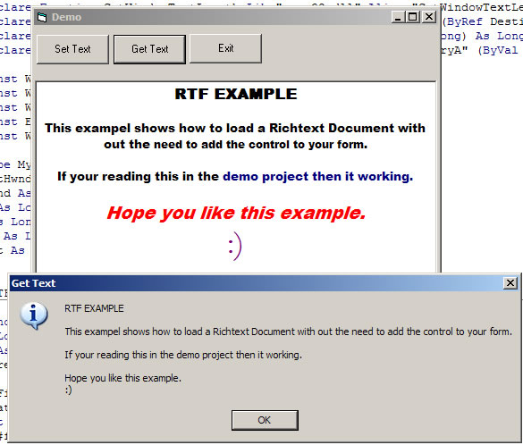



## RichText Without an OCX

### Description

Hi this example shows you how to use the RichEdit control but with out needing to add it to your form. all it uses is a few API calls, anyway hope you find this little example usfull.
 
### More Info
 

             |
---                |---
**Submitted On**   |2006-11-22 19:10:02
**By**             |[dreamvb](https://github.com/Planet-Source-Code/PSCIndex/blob/master/ByAuthor/dreamvb.md)
**Level**          |Beginner
**User Rating**    |5.0 (75 globes from 15 users)
**Compatibility**  |VB 6\.0
**Category**       |[Custom Controls/ Forms/  Menus](https://github.com/Planet-Source-Code/PSCIndex/blob/master/ByCategory/custom-controls-forms-menus__1-4.md)
**World**          |[Visual Basic](https://github.com/Planet-Source-Code/PSCIndex/blob/master/ByWorld/visual-basic.md)
**Archive File**   |[RichText\_W20325611222006\.zip](https://github.com/Planet-Source-Code/dreamvb-richtext-without-an-ocx__1-67164/archive/master.zip)

